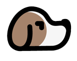

<div class="intro" align="center">


<h2>Puppr</h2>

Puppr is built for Laravel and used to guard modular SaaS applications.

Give your users or admins access to features within your software / service and prevent them from accessing functionality unless permitted.

<hr>
  
## Package is in development (watch / star until a version 1.0 release)

</div>

## Installation

[Find us on Packagist.org](https://packagist.org/packages/trench94/puppr)

1. Install with composer

```markdown
composer require trench94/puppr
```
2. Run the install command with artisan
```markdown
php artisan puppr:install
```

### Documentation

[View our documentation](https://trench94.github.io/Puppr/)

### Contribute
[Take a look](https://github.com/Trench94/Puppr/issues) at our open issues if you want to contribute to our package

